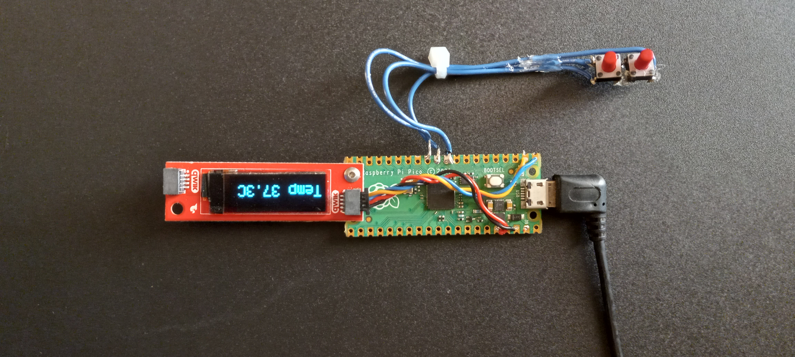
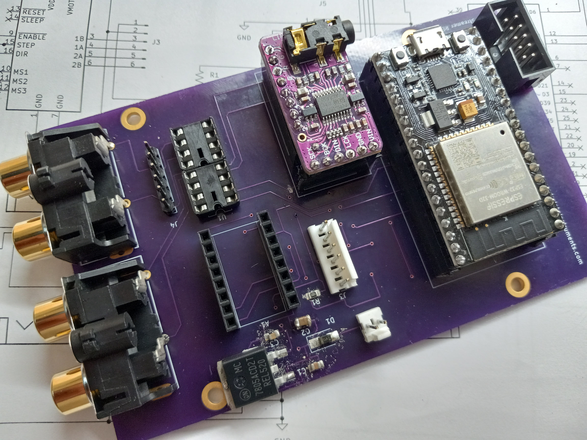
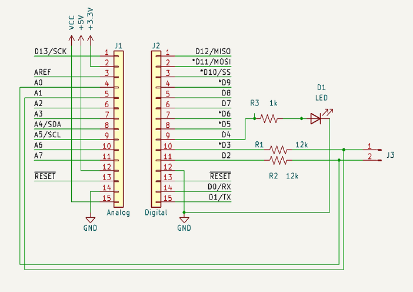
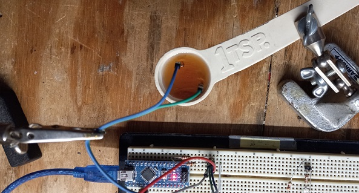

## [Thermometer simulator ](https://github.com/cedarlakeinstruments/theselittlemachines/edit/main/README.md#thermometer-simulator)

Simple digital thermometer simulator based on Raspberry Pi Pico and
a Sparkfun SSD1306-type OLED connected via I2C. Of course, the code's written in Python ;-)

You can download it [here](code/code.py)

The desire is to display a temperature that is adjustable in 0.1 degree increments by pushbuttons. The pushbuttons are connected between Ground and GP7 & GP8.
At least, that was the intent. However, my ham-fisted soldering connected the common to GP9 instead of GND. 

No problem, though. We'll just turn GP9 into an output and pull it to GND. Accomplishes the same thing and I don't have to fix my wiring :-)

~~~
# Code designed for Raspberry Pi Pico running CircuitPython 9.2
# Simulates a digital thermometer using an OLED for display

# Imports
import time 
import random
import board
import busio
import digitalio
from adafruit_debouncer import Debouncer
import displayio
import terminalio
import adafruit_displayio_ssd1306 as ssd1306
from adafruit_display_text import label

# Compatibility with both CircuitPython 8.x.x and 9.x.x.
# Remove after 8.x.x is no longer a supported release.
try:
    from i2cdisplaybus import I2CDisplayBus
    print ("Imported from i2cdisplaybus")
except ImportError:
    from displayio import I2CDisplay as I2CDisplayBus
    print ("Imported from displayio")
    
# Reinitalizes display upon any soft reboot or hard reset
displayio.release_displays()

# Set up I2C and the pins we're using for it
i2c0 = busio.I2C(scl=board.GP1, sda=board.GP0)

# Short delay to stop I2C falling over
time.sleep(1) 

# Configure display size
ssd_width = 128
ssd_height = 32

# Ensure the physical address of your SSD1306 is set here:
ssd_bus = I2CDisplayBus(i2c0, device_address=0x3C)
display = ssd1306.SSD1306(ssd_bus, width=ssd_width, height=ssd_height)

# Text labels for display
temp_label = label.Label(terminalio.FONT)
temp_label.anchor_point = (0.0, 0.0)
temp_label.anchored_position = (0, 10)
temp_label.scale = 2

# Create DisplayIO Group Layer
layer1 = displayio.Group()
layer1.append(temp_label)
display.root_group = layer1

# Pushbuttons on pins 7 & 8
up_pin = digitalio.DigitalInOut(board.GP8)
up_pin.direction = digitalio.Direction.INPUT
up_pin.pull = digitalio.Pull.UP
buttonUp = Debouncer(up_pin)

down_pin = digitalio.DigitalInOut(board.GP7)
down_pin.direction = digitalio.Direction.INPUT
down_pin.pull = digitalio.Pull.UP
buttonDown = Debouncer(down_pin)

# debug due to my wiring screwup
gnd = digitalio.DigitalInOut(board.GP9)
gnd.direction = digitalio.Direction.OUTPUT
gnd.value = False

temp = 37.0
last_temp = 0.0
# Constants
TEMP_INCREMENT = 0.1
TEMP_MIN = 30
TEMP_MAX = 40

while True:
    buttonUp.update()
    buttonDown.update()
    # Check button change state
    if buttonDown.fell:
        temp -= TEMP_INCREMENT
        print(temp)
    elif buttonUp.fell:
        temp += TEMP_INCREMENT
        print(temp)
        
    if temp < TEMP_MIN:
        temp = TEMP_MIN
    elif temp > TEMP_MAX:
        temp = TEMP_MAX
    
    # Only update on a change
    if last_temp != temp:
        # Format for display   
        temp_label.text = f"Temp {temp:.1f}C"
        last_temp = temp
~~~

---

## [Ball Speed Project](https://github.com/cedarlakeinstruments/theselittlemachines/edit/main/README.md#ballSpeed)

This project measures the speed of a ball and takes actions depending on how fast it's going. It plays audio feedback depending on the speed of the ball.
Code is [here](https://github.com/cedarlakeinstruments/theselittlemachines/tree/main/BallSpeed)

---

## [High/Low solenoid driver](https://github.com/cedarlakeinstruments/theselittlemachines/main/README.md#hi-lo)

Driving solenoids is pretty easy. Just need a single digital pin and a motor or solenoid driver. Since it takes more energy to activate the
solenoid than to keep it on, we can apply this method if we need to save power.
We'll activate the solenoid at full power for about a quarter second (or however long it takes it to move into position, then drop
the output level by PWM).

You can download it [here](code/solenoid/solenoid.ino)

---
## [Liquid Level Sensor ](https://github.com/cedarlakeinstruments/theselittlemachines/main/README.md#level)
How to detect the liquid surface when filling a syrup bottle. Simple liquid level sensor senses conductivity using two food-safe
stainless steel probes.
An Arduino Nano drives the probes with a low-current signal, using the fluid to provide conductivity. Two analog inputs are used to detect the current flow
through the liquid. By switching the current back and forth, we can prevent mineral buildup on the probes.

When the measured signal crosses a threshold, we turn on an output to indicate that the level is detected. The output can stop a pump, or trigger an indicator to the
operator.

Download the code [here](LiquidLevelSensor/LiquidLevelSensor.ino)

Schematic diagram

